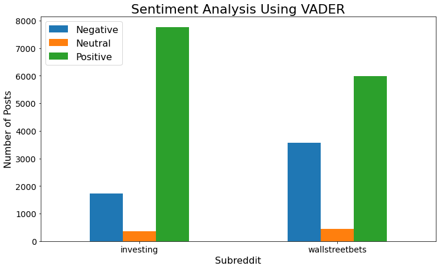

# Distinguishing Between Speculative Investment Tips

[Problem Statement](#Problem-Statement)  
[Summary](#Summary)  
[Data Dictionary](#Data-Dictionary)  
[Data Pulling](#Data-Pulling)  
[Data Discovery](#Data-Discovery)    
[Pipeline Modeling](#Pipeline-Modeling)  
[Conclusions and Recommendations](#Conclusions-and-Recommendations)  
[What Next](#What-Next)

### Problem Statement

In an effort to identify and differentiate between messaging focused on investments of various types, I took to the task of exploring two investment related social media groups and how they differ. I attacked this problem using the Reddit platform and specifically the r/Investing and r/WallStreetBets subreddits. r/Investing and r/WallStreetBets are both investment focused subreddits with a slightly different take on strategies. While there is no regulation enforcing these differences on Reddit, for the most part, r/Investing focuses on safer, more researched and thought out investment strategies. r/WallStreetBets, on the other hand, typically focuses on more speculative, less safe investment strategies. Being able extrapolate to distinguish between these two types of messages would be valuable to anyone considering investing and trying to determine if a strategy was well researched and less speculative.

In order to evaluate the differences between the messaging of these two groups, I will utilize three machine learning models - Multinomial Naive Bayes, Random Forests, and Logistic Regression. All three models will be coupled with a vectorizer, either the CountVectorizer or TfidfVectorizer, in order to process the data. In order to evaluate the success of the models, I will examine the sensitivity rates for each model instead of evaluating for the accuracy of predictions.

___
### Summary

Things to look into in this report:
- What are the differences between r/Investing and r/WallStreetBets with respect to post lengths?
- What are the most common words and phrases present in both subreddits?
- What are the general sentiments of the posts between the two subreddits?
- Which model and hyperparameters will result in the highest sensitivity score?
- Is it possible to distinguish the posts with a decent degree of accuracy for this study to be effective?

___
### Data Dictionary

|Feature|Type|Source|Description|
|---|---|---|---|
|**title**|*object*|Pushshift API|Title of the Reddit post|
|**selftext**|*object*|Pushshift API|Body text of the Reddit post|
|**author**|*object*|Pushshift API|Username of the person who wrote the post|
|**subreddit**|*object*|Pushshift API|Name of the subreddit that the post was pulled from|
|**sub_target**|*int*||Subreddit converted into binary for modeling|
|**combined**|*object*||Concatenated value from title and selftext|
|**char_count**|*int*||Total number of characters in the combined tex|
|**word_count**|*int*||Total number of words in the combined tex|
|**tokens**|*object*||Tokenized text from combined text|
|**stemmed**|*object*||Stemmed text from the tokenized text|
|**stock_sentiment**|*float*||Sentiment score based on stock/investment specific terminology|
|**compound_sent**|*float*||Compound sentiment score from VADER analysis|
|**stock_sentiment_sign**|*object*||stock_sentiment converted into "positive", 'neutral', and "negative"|
|**compound_sent_sign**|*object*||compound_sent converted into "positive", 'neutral', and "negative"|

___
### [Data Pulling](https://git.generalassemb.ly/jsalisbury731/project_3/blob/master/code/01_reddit_scraper.ipynb)

The first step of this project was to collect the data required for a balanced study. In order to do this, I utilized the Pushshift.io API which is a 3rd party API similar to Reddit's official API. Using the Pushshift API, I created a function to enable me to pull posts with relative ease and efficiency. The function accepted three parameters for its collecting - the subreddit name to pull from, the minimum number of posts to pull, and whether or not to only pull self posts.

While the subreddit name is straightforward, pulling the correct number of posts proved a challenge. This is because in the two subreddits I was working with, many of the posts pulled were either marked as [removed] or [deleted]. Therefore, I embedded two drop statements into my loop to drop any removed or deleted posts and check the remaining number of posts against the minimum posts requested. I found that depending on the subreddit, I averaged about 60 - 80 posts accumulated per loop (as compared to the actual 100 that were originally pulled). I also built into the function the ability to pull only self posts - which are posts that have both a title and a body to the post. In doing this, I would ensure I had an ample amount of data to work with as compared to pulling posts that may consist of only titles. 

For both subreddits, I ended up pulling a minimum of 10,000 posts that were all self posts.

___
### [Data Discovery](https://git.generalassemb.ly/jsalisbury731/project_3/blob/master/code/02_eda.ipynb)

- My initial dive into the data began by pulling in the two sets of posts, joining them, and mapping the subreddits to 0s and 1s to use as my target. In doing so, I assigned r/WallStreetBets to 1 and r/Investing to 0.
- Next, I combined the titles and selftext of the posts to create one single string. I calculated the character counts for each post and word counts, using the combined strings as my data.
- I validated that there was close to an even split in posts between the two subreddits and examined the descriptive statistics for both character and word counts. Interestingly, the data presented several outliers based on these statistics.
- Reasonably, many of the outlier posts for character count and word count were the same posts. The mean character count was 841 characters with the maximum being 39,979 characters. For the word counts, the mean was 137 words with the maximum being 5,955 words. While the longest character post appeared to be created by a scraping bot, there were still eight posts with over 30,000 characters.
- 8 out of 10 of the top posts in both categories (character count and word count) were attributed to the r/WallStreetBets subreddits. And unsurprisingly, 9 of the top 10 word count posts were written by three authors, indicating a tendency for certain authors to write longer posts.
- In an effort to more easily visualize the majority of the posts, I filtered the character counts to posts with less than or equal to 9,000 characters and word counts to posts with less than or equal to 1,500 words.

  

- Both the character count and word count plots showed relatively the same thing. There was a significantly higher frequency of r/WallStreetBets than r/Investing posts in the first two bins. However, in the third and higher bins, r/Investing posts were noticably longer than the r/WallStreetBets posts. This correlates with the idea that r/WallStreetBets posts are possibly more speculative and less researched, with less facts and information to back them up than r/Investing posts.
  
- As part of my EDA, I also looked at the most common words and bigrams. Before doing this, however, I removed stopwords to see what the remaining text consisted of. The majority of the unigrams and bigrams involved either internet protocol terminology or actual investment terms.

  

- The last thing I wanted to examine was the sentiment of the posts. Considering an investment post or recommendation could be either positive or negative, I decided to examine this in two different manners. The first way I looked at it was using a custom generated list of positive and negative investment terms. Doing so showed approximately the same split between the two subreddits, with a majority being positive-focused investment posts and a much lesser, but close to even amount of neutral and negative posts.

- The second sentiment analysis I looked at was a true sentiment analysis using the VADER dictionary, trying to determine whether a post had an overall positive, negative, or neutral overall tone. 

- The first thing I noticed was that there were significantly less neutral posts. Considering a neutral post had a compound score of 0, this is unsurprising as the VADER dictionary is much more robust than my customer generated lists and would likely score a post as at least slightly positive or negative. The next thing I noticed was the differences between the two subreddits. While r/WallStreetBets had around the same number of positive posts, the negative posts increased significantly. However, the difference in the r/Investing neutral posts seemed to primarily be classified as additional positive posts, converse to what happened with r/WallStreetBets.
- After exploring the data, I expect to be able to answer my problem statement with the provided data. The only question is how sensitive and accurate my model will be to distinguishing the messaging.

___
### [Pipeline Modeling](https://git.generalassemb.ly/jsalisbury731/project_3/blob/master/code/03_pipeline_modeling.ipynb)

After reading in my data and dropping any unecessary columns, I set my X feature and y target and performed a train-test-split of the data for validation purposes. My baseline accuracy showed a majority of posts being from r/WallStreetBets with 50.41% of posts and r/Investing compromising 49.59% of posts. This meant that my model would need to classify posts better than 50.41% accuracy to improve over the baseline model.

#### Multinomial Naive Bayes

The first model which I implemented was a Multinomial Naive Bayes model. I expected this to be my best performing model due to its use in text classification and large datasets. After performing multiple iterations of the grid search, I determined my best Naive Bayes model resulted from using the CountVectorizer and specifically tuned parameters. My accuracy score came out to be 0.870 and more importantly, my sensitivity or recall score ended up being 0.846. I also generated a confusion matrix to visualize my model's performance. However, this was not my best model.

#### Random Forests

The second model which I tested was a Random Forests model. Again, I performed multiple grid searches and determined my best Rnadom Forests model resulted from using the TfidfVectorizer and specifically tuned parameters. I incorporated three additional parameters into this pipeline that were specific to the Random Forests model. My accuracy score came out to be 0.865 and my sensitivity score ended up being 0.821. This was a small decrease in sensitivity compared to my Naive Bayes model.

#### Logistic Regression

The last model I evaluated was a Logistic Regression model. I ended up using the CountVectorizer and specifically tuned parameters which produced my best testing model. My accuracy score came out to be 0.870 and my sensitivity score ended up being 0.868, both high scores across my three models.

___
### Conclusions and Recommendations

After initially pulling the necessary data for this project, the exploratory data analysis uncovered some interesting highlights. The presence of outliers was surprisingly dominated by r/WallStreetBets posts and most of the top posts were authored by a select few Redditors. After plotting the most commonly occuring unigrams and bigrams, it was clear that some of these words should be considered for removal from the analysis.

This led to the models. I selected sensitivity as my primary metric to optimize for due to the preference of falsely classifying an r/Investment rather than falsely classifying an r/WallStreetBets post. I opted for this choice because I thought it was more important to let some "safer", less speculative investment tips slip through the cracks than shoot for a higher accuracy and classify riskier tips as safe. Again, this is all based on the assumption that the data between the two subreddits is largely distinguishable, which is a necessary assumption based on the anonymity and unregulated nature of Reddit.

My recommendation based on optimizing sensitivity for this task is to use the Logistic Regression model. With The Naive Bayes model performing relatively well in comparison to the Logistic Regression model, the sensitivity of the LR model was more than two percentage points higher than the NB model. Considering LR is a discriminative model (as compared to NB being a generative model), this is advantageous since my primary concern to satisfy this problem statement is being able to identify the boundary and separate the data into two classes. I am less concerned with identifying the hidden parameters and understanding the underlying distribution of data, which is more common with generative models. LR also works better with collinearity than NB, and considering textual data is often not colinear (since certain words are commonly adjacent or work together), the Logistic Regression model seems more suitable.

With further development, using this model a person could theoretically import an investment tip or strategy into it and the model would be able to identify whether the strategy/message more closely aligned with a safer investment strategy that would be found in r/Investing as compared to a riskier, less researched post that would be found in r/WallStreetBets. That is not to say any investment strategy should be acted upon without doing due diligience, but it is a start to have an understanding of whether a tip is closely aligned with a 'bet' or an actual safe 'investment'.
___

### What Next

Things I would like to look into as the project continues:
- Investigate the sentiment analysis and the reasoning behind the discrepancy in the VADER analysis with the similarity in the investment term analyis.
- Incorporate posts' comments and evaluate for their sentiments to try to establish whether the posts' contents from each subreddit are looked upon favorably or not. This would provide further insight into the general consensus and whether other users considered posts risky or even unfounded.
- Further build out the investment term lexicon to include bigrams and perform a more indepth investment sentiment analysis on the posts.